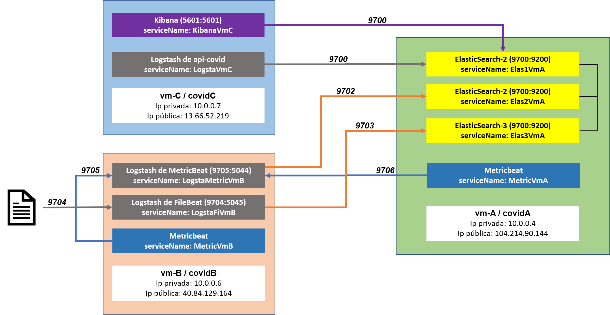

# ELK_Cluster_Docker
Es un cluster que consta de 3 maquinas distintas, en una sola maquina se encuentran 3 nodos de elasticsearch, recibe informaciòn de diferentes fuentes de información.

La principal fuente de información proviene de una api gratuita y que despliega la información actualizada en tiempo real de las estadisticas del coronavirus

Adjunto se encuentra una imagen donde se da la exxplicación de una guía básica de lo que se busca hacer en este proyecto


| IP | MAQUINA |
| ------------- | ------------- |
| 104.214.90.144  | vm-A   |
| 40.84.129.164  | vm-B  |
| 13.66.52.219  | vm-C  |

## Prerrequisitos:

1. Contar con un ambiente de 3 maquinas / servidores distintos
2. Tener instalado previamente Docker y Docker-compose en estas máquinas
3. Tener instalado previamente Java jre

## Preliminar
Donde vayas a clonar el repositorio recomiendo que tengas instalado git para ingresar el siguiente comando:
```
git clone https://github.com/Jairgo/ELK_Cluster_Docker.git
```
Dentro de la carpeta que acabas de clonar deberás ejecutar el archivo “script.sh” escribiendo en tu línea de comandos: ./script.sh, después de esto se te presentarán
```
./script.sh
```

Ingresa las ips que ocuparás para manejar tu entorno de servidores:
```
Introduza la ip de su máquina/servidor 1
x.x.x.x
Introduza la ip de su máquina/servidor 2
x.x.x.x
```
Deberás copiar cada carpeta del repositorio en una carpeta distinta a la generada por el clonado, esto, en cada maquina o servidor por separado.

Por ejemplo, si te encuentras ubicado en el servidor 1, ahí crearás una carpeta nueva.
Esto se hace para que no se causen conflictos con las carpetas y contenidos originales por la creación de información que genera Docker.

Al terminar deberás tener en cada servidor una copia fidedigna de cada una de las carpetas originales en el repositorio

## Eliminación de carpeta

Si por algún motivo se encuentra la carpeta “data” en la ruta:
```
vm-B/filebeB/data/registry
```
Entonces esa carpeta no la deberás copiar del repositorio o bien eliminar de tu carpeta local.

## Instalación:

Ingresa a cada una de las carpetas locales que copiaste en cada uno de tus servidores e ingresa el siguiente comando:
```
docker-compose up -d
```
Espera un momento y para revisar los logs de los contenedores y su funcionamiento al momento de iniciar, ingresa el siguiente comando:
```
docker-compose logs -f
```
## Comprobación:

Ingresa el comando:
```
curl -XGET ip_server_elastic:9700/_cat/nodes
```
Ingresa el comando: 
```
curl -XGET ip_server_elastic:9700/_cat/índices
```

## importación de objetos:
Para importar el dashboard y las demás graficas deberás entrar al siguiente link desde cualquier navegador:
```
ip_server_kibana:5601
```
Da clic en el menú lateral izquierdo.

Desplázate hasta management y da clic en “stack management”.

Da clic en “import”: y selecciona el archivo “export.ndjson” que clonaste del repositorio.


## Posibles problemáticas
De ser el caso en el que alguno de tus nodos de elastic se detenga con codigo de error de salida 78, ejecuta el siguiente comando
```
sudo sysctl -w vm.max_map_count=262144
```
